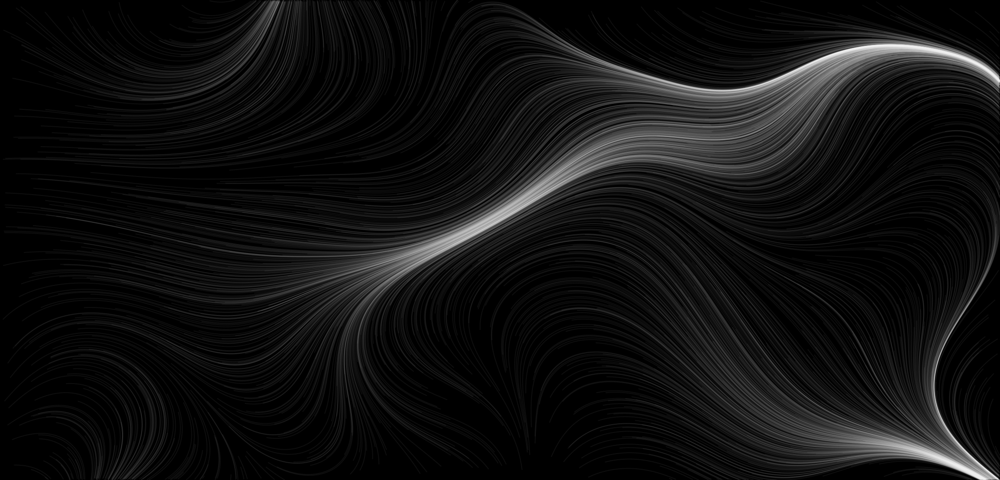

# Generative Art

This repository collects small projects exploring generative art techniques using Python. Each notebook focuses on a different method for creating visual patterns.

## Gallery

|  |
|:--:|
| *Perlin noise flow field* |